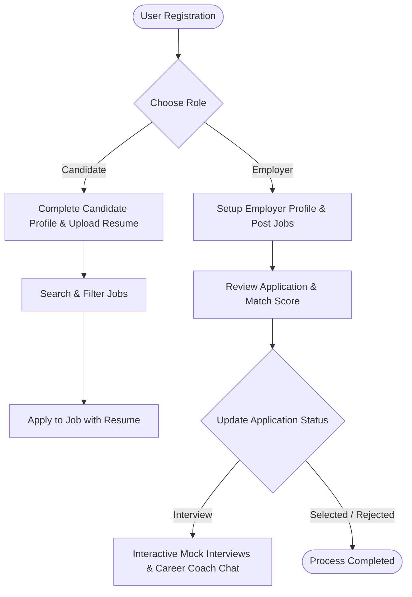

# PROJECT_ANALYSIS.md

# TetraHire - Smart Job Application Portal
An AI-Powered Job Board & Applicant Tracking System (ATS)

---

## 1. Project Overview & Detail
**TetraHire** is a modern, full-stack, recruitment and job search web application designed to bridge the gap between job seekers (Candidates), recruiters (Employers), and system monitors (Admins). The portal addresses major inefficiencies in typical hiring pipelines by providing:
- **Interactive Dashboards** for Candidates, Employers, and Admins.
- **ATS Resume Analyzer & Match Scoring** that uses custom criteria to benchmark qualifications against specific job listings.
- **Real-Time Interactive AI Assistants** including a Cover Letter Generator, Mock Interview simulator, and AI Career Coach.
- **Seamless Fallback Mechanisms** including a full Client-Side Demo/Sandbox database simulation (using standard adapter pattern extensions on Axios) to allow the application to remain functional even if MongoDB Atlas or the backend server is temporarily unreachable.
- **Notification Pipelines** and an **Expired Job Expiry Scheduler** to automate operational status updates.

---

## 2. Feature Directory (By Category)

### Candidate Features
- **Job Discovery Feed**: Advanced keyword filtering, geographic matching, salary slider, category taxonomy, and type filters (Remote/Hybrid/Onsite).
- **Interactive Candidate Profile Builder**: Customizable sections for personal details, skills tags, work history, education history, and social links.
- **One-Click Application**: Apply to jobs with a resume selection and automatic cover letter attachments.
- **Application Status Tracker**: Step-by-step progress tracking for applied jobs (Applied → Under Review → Shortlisted → Interview → Selected/Rejected).
- **Saved Jobs Hub**: Bookmark job listings to apply to later.
- **Notification Inbox**: Toast popups and standard list notifications for status changes.

### Employer Features
- **Job Posting Wizard**: Define job descriptions, skill lists, salary ranges, and deadlines.
- **Applicant Tracking Board**: View list of applicants, access their profile and resume details, and update application status (with automatic notification trigger).
- **Company Profile Editor**: Showcase company culture, site logo, description, domain, and location.
- **Recruiter Statistics Overview**: View active job counts, total applicants, and status breakdown.

### Admin Features
- **System Monitoring Dashboard**: Display total platform users, active listings, total applications, and overall metrics.
- **User Management Control**: Search, sort, filter, and inspect user profiles (Candidates, Employers, Admins).
- **Job Listing Moderation**: Delete or close inactive/inappropriate postings.
- **Job Ingestion Utility**: Ingest external/mock job feeds automatically into the database.

### Authentication Features
- **Role-Based Authentication**: Custom sign-ups and logins for `candidate`, `employer`, and `admin` users.
- **JWT Multi-Token Architecture**: Short-lived Access Tokens (15m) + Long-lived Refresh Tokens (7d) stored securely.
- **Auto-Refresh Mechanism**: Seamless silent token renewal interceptor on API calls.

### AI Features
- **AI Job Matching**: Instant Match Scores based on candidate skill intersections and resume keywords.
- **AI Resume Builder & Scorer**: Automated resume checker for ATS compatibility.
- **Mock Interviews**: Interactive simulated interview sessions with responsive AI feedback.
- **AI Career Coach / HelpChat**: Dynamic chat widget acting as a career advisor.

### Backend Features
- **Modular RESTful Architecture**: Clean Separation of Concerns via Models, Controllers, Services, Middlewares, and Routes.
- **Job Expiry Cron Scheduler**: Active cron job checks and updates expired job listings.
- **Winston logger**: Configurable logging (`info`, `error`) for diagnostic tracking.

### Database Features
- **Advanced Mongoose Schemas**: Strict validation, timestamp automation, and hooks.
- **Optimized Indexes**: Unique compound indexes, sparse indexes, and full-text indexes (`title` & `description`) for search.

### Security Features
- **Helmet Headers**: Secure HTTP headers block cross-site scripting and sniffing.
- **CORS Constraints**: Restrict unauthorized origins from calling internal endpoints.
- **Express Rate Limiter**: Prevent brute force attacks on auth routes.
- **Bcrypt Hashing**: Multi-round password salting and verification before database persist.

---

## 3. User Flow Lifecycle


1. **Onboarding**: User registers as a Candidate or Employer.
2. **Setup**: Candidate builds their profile and uploads a resume; Employer specifies company details.
3. **Discovery**: Candidate filters listings; AI calculates match scores.
4. **Application**: Candidate applies.
5. **Evaluation**: Employer updates applicant status.
6. **Decision**: System triggers real-time notifications for candidate interviews, selections, or rejections.

---

## 4. API Endpoints Sheet

### Auth Routes
- `POST /api/auth/register` - Create user profile
- `POST /api/auth/login` - Authenticate & return token set
- `POST /api/auth/refresh-token` - Renew access token
- `GET /api/auth/me` - Fetch authenticated user session profile
- `POST /api/auth/logout` - Clear user active tokens

### Candidate Routes
- `GET /api/candidate/profile` - Fetch current candidate profile
- `PUT /api/candidate/profile` - Update candidate profile details
- `GET /api/candidate/applications` - Fetch applicant's job requests
- `POST /api/candidate/apply/:jobId` - Submit new application
- `GET /api/candidate/resumes` - Retrieve list of uploaded resumes
- `POST /api/candidate/resumes` - Save a new resume
- `DELETE /api/candidate/resumes/:id` - Delete selected resume
- `POST /api/candidate/saved-jobs/:jobId` - Bookmark job
- `DELETE /api/candidate/saved-jobs/:jobId` - Unbookmark job
- `GET /api/candidate/saved-jobs` - Get bookmarked jobs

### Employer Routes
- `GET /api/employer/profile` - Get company details
- `PUT /api/employer/profile` - Edit company details
- `GET /api/employer/dashboard` - Retrieve employer statistics & applications
- `GET /api/employer/jobs` - View employer's posted job positions
- `POST /api/employer/jobs` - Post a new job position
- `PUT /api/employer/jobs/:id` - Edit job details
- `DELETE /api/employer/jobs/:id` - Mark job listing as deleted
- `PUT /api/employer/applications/:id/status` - Update candidate status

### Admin Routes
- `GET /api/admin/users` - Manage registered accounts
- `DELETE /api/admin/users/:id` - Ban/remove accounts
- `GET /api/admin/jobs` - Moderation view of all platform jobs
- `DELETE /api/admin/jobs/:id` - Moderation delete of job
- `POST /api/admin/jobs/import` - Bulk ingest jobs
- `GET /api/admin/stats` - Overall system health metrics

### Notification Routes
- `GET /api/notifications` - Retrieve alerts
- `PUT /api/notifications/:id/read` - Mark alert as read

---

## 5. Database Schema & Relationships

### MongoDB Collections and Field Maps:
1. **User**: Name, Email, Password (hashed), Role (`candidate`/`employer`/`admin`), ProfileImage.
2. **CandidateProfile**: CandidateId (Ref User), Summary, Skills, Experience, Education, Socials.
3. **EmployerProfile**: EmployerId (Ref User), CompanyName, Description, Website, Location, Industry.
4. **Job**: EmployerId (Ref User), Title, Description, Location, JobType, EmploymentType, Salary, Experience, SkillsRequired, Category, Deadline, Status.
5. **Application**: JobId (Ref Job), CandidateId (Ref User), ResumeId (Ref Resume), Status, CoverLetter, Timeline (appliedAt, shortlistedAt, etc.).
6. **Resume**: CandidateId (Ref User), Title, Content/Text, FilePath, AtsScore.
7. **SavedJob**: CandidateId (Ref User), JobId (Ref Job).
8. **Notification**: UserId (Ref User), Title, Message, IsRead, Type.
9. **RefreshToken**: UserId (Ref User), Token, ExpiresAt.

### Schema Relationships:
- **One-to-One**: `User` ↔ `CandidateProfile` | `User` ↔ `EmployerProfile`
- **One-to-Many**: `User` (Employer) → `Job` | `User` (Candidate) → `Application` | `User` (Candidate) → `Resume` | `User` (Candidate) → `SavedJob` | `User` (Any) → `Notification`
- **Many-to-One**: `Application` → `Job` | `Application` → `Resume`

---

## 6. Technology Stack
- **Frontend**: React (v19), React Router DOM (v7), Framer Motion (for animations), Lucide React (for iconography), PostCSS, TailwindCSS (for responsive UI/UX styling).
- **Vite**: Ultra-fast bundler and hot-module reloading server.
- **Backend**: Node.js, Express (v5).
- **Database**: MongoDB (v7), Mongoose (v9) OR Client-side mock backend fallback adapter.
- **Security & Utilities**: JWT, BcryptJS, Morgan, Winston, Helmet, Express Rate Limit, Swagger UI.

---

## 7. Directory Tree & Architecture
```
TetraHire/
├── client/                     # FRONTEND (Vite + React)
│   ├── src/
│   │   ├── components/         # Reusable layouts, navbars, and chatbot widget
│   │   │   ├── Navbar.jsx
│   │   │   ├── Footer.jsx
│   │   │   └── HelpChat.jsx
│   │   ├── context/            # AuthContext, ToastContext
│   │   ├── pages/              # Primary client-side view pages
│   │   │   ├── Home.jsx
│   │   │   ├── CandidateDashboard.jsx
│   │   │   ├── EmployerDashboard.jsx
│   │   │   ├── AdminDashboard.jsx
│   │   │   └── Jobs.jsx
│   │   └── utils/
│   │       ├── api.js          # Custom Axios interceptors & sandbox database fallback
│   │       └── mockBackend.js  # Sandbox DB simulation when MongoDB is offline
│   ├── index.html
│   └── package.json
└── server/                     # BACKEND (Node.js + Express)
    ├── config/                 # db.js, logger.js, swagger.js
    ├── controllers/            # Controller layer
    ├── middleware/             # authMiddleware.js, errorHandler.js, rateLimiter.js
    ├── models/                 # Database Schema definitions
    ├── routes/                 # Express route configurations
    ├── services/               # Expired jobs checker & dashboard aggregations
    ├── index.js                # App entrypoint
    └── package.json
```

---

## 8. Reusable Frontend Components
1. **Navbar**: Responsive top layout with theme toggle, notification badge, and authentication status.
2. **Footer**: Layout showcasing portal structure, links, social hooks, and newsletter subscription form.
3. **HelpChat Widget**: Dynamic chat overlay incorporating a career assistant chatbot.
4. **BackToTop**: Dynamic click-to-scroll utility popping up on long pages.
5. **BottomNav**: Sticky bottom navigation layout for mobile screens.
6. **Logo**: Reusable svg vector branding for consistent logo styling.

---

## 9. System Robustness, Validation, and Optimizations

### Validation & Error Handling
- **Database Rules**: Regex checks on emails, required field warnings, enum constraints, and schema triggers.
- **Backend Error Handler**: Unified error middleware intercepts database crashes or duplicate key indices, formatting clean JSON responses.
- **Frontend Fallbacks**: Axios interceptors automatically shift the application into Local Demo/Sandbox Mode on connection error (`ERR_NETWORK`).

### Responsive Layouts & Performance
- **Flexibility**: Responsive Tailwind grids handle screens ranging from mobile viewports to widescreen displays.
- **Database Speed**: Mongoose index coverage for indexed properties (`employerId`, `status`, `jobType`, etc.) minimizes MongoDB lookup times.

---

## 10. Complexity Assessment
- **Complexity Rating**: **Intermediate to Advanced (7.5/10)**
- **Justification**: The app features a complete role-based schema structure, JWT authentication with automatic silent refresh, background cron scheduling, and an offline-first mock DB adapter on the client.

---

## 11. GitHub-Ready README.md
*(Suitable for immediate deployment in repository)*

```markdown
# TetraHire - AI Job Board & ATS

TetraHire is a modern job portal and application tracking system built with the MERN stack.

## Getting Started

### 1. Prerequisites
- Node.js (v18+)
- MongoDB Atlas account (or local database instance)

### 2. Environment Setup
Create a `.env` file in the root:
```env
PORT=5000
MONGODB_URI=your_mongodb_uri
JWT_SECRET=your_jwt_secret
JWT_REFRESH_SECRET=your_jwt_refresh_secret
```

### 3. Server Installation & Execution
```bash
cd server
npm install
node index.js
```

### 4. Client Installation & Execution
```bash
cd client
npm install
npm run dev
```
```

---

## 12. Internship Summary & Resume Descriptions

### Internship Project Summary
> **Project Name**: TetraHire Job Application Portal  
> **Role & Impact**: Designed and developed a full-stack, role-based job board application. Created the backend routes, database models, and structured frontend dashboard pages. Implemented silent JWT token refresh interceptors and an offline demo mock adapter that maintains full application functionality if connection issues occur.

### Resume-Ready Project Description
- **Full-Stack Developer (TetraHire Project)**: Designed a role-based job platform using React, Node.js, Express, and MongoDB. Structured schemas with indexes to optimize lookup performance and implemented JWT access/refresh token lifecycles with silent token renewals. Implemented a client-side mock adapter fallback to allow full sandbox functionality offline.

### ATS-Friendly Description
> Full-Stack Web Application built with React, Node.js, Express, and MongoDB. Features role-based access control, JSON Web Tokens (JWT) for authentication, index-optimized database queries, background cron task schedulers, and responsive UI components.

---

## 13. Production Readiness Strategy
To move TetraHire to production:
1. **Containerization**: Add Dockerfiles and Kubernetes deployment manifests.
2. **Cloud Storage**: Integrate AWS S3 or Google Cloud Storage for resume uploads.
3. **OAuth Integration**: Add Google, GitHub, and LinkedIn social login buttons.
4. **CI/CD**: Configure GitHub Actions to automate linting, tests, and build pushes.
5. **Real-time Engine**: Integrate Socket.io for immediate chat message dispatching.
